<p align="center">
  
</p>

<h1 align="center">Silicon Holo Design</h1>

<p align="center">
  全息科幻风格 React UI 组件库 — 内置 AI/Chat 组件、国际化与主题定制。
</p>

<p align="center">
  
  
  
  
</p>

<p align="center">
  <a href="#快速开始">快速开始</a> ·
  <a href="#组件列表">组件列表</a> ·
  <a href="#聊天组件">聊天组件</a> ·
  <a href="#ai-聊天">AI 聊天</a> ·
  <a href="#主题定制">主题定制</a> ·
  <a href="#国际化">国际化</a> ·
  <a href="#示例">示例</a> ·
  <a href="./README.md">English</a>
</p>

---

## 光谱扁平设计

`0.2.0` 在不改变组件调用方式的前提下升级了整体视觉。新版采用深空近黑表面、中性结构描边、低填充控件与局部青蓝紫光谱响应。青色仍是核心识别色，但主要用于焦点、激活状态、数据信号与品牌场景，而不再铺满每一个面板。

- 按钮使用 tonal fill 与稳定的中性边界保持扁平，不再依赖顶部高光或发光框体。
- Card、工具面板和消息表面使用叠加在深空底色上的半透明光谱薄膜；普通控件仍默认不使用 blur。
- Drawer、Modal、Popover、Tooltip 与 Toast 使用克制的玻璃浮层材质，Payload 与代码区域使用更深的 inset surface。
- selected/open 通过 tonal fill 或局部边缘表达；外层 focus frame 仅服务键盘焦点，不再形成第二圈发光边框。
- `.holo-text` 默认静态，仅用于品牌或 Hero；动态效果需显式使用 `.holo-text-animated`，并支持 reduced motion。

---

## 快速开始

```bash
npm install silicon-holo-design
```

```tsx
import 'silicon-holo-design/styles'
import { HoloButton, LocaleProvider, zhCN } from 'silicon-holo-design'

function App() {
  return (
    <LocaleProvider locale={zhCN}>
      <HoloButton variant="primary">你好，全息世界</HoloButton>
    </LocaleProvider>
  )
}
```

### 样式文件（必须）

`import 'silicon-holo-design/styles'` 是**必须的** — 它提供所有组件依赖的 CSS 变量（`--shd-*`）和基础样式。不导入的话，颜色和主题将无法正常工作。

### UnoCSS 预设

```ts
// uno.config.ts
import { presetSiliconHolo } from 'silicon-holo-design/preset'

export default defineConfig({
  presets: [presetUno(), presetSiliconHolo()],
})
```

预设包含颜色、快捷方式、字体以及库组件使用的所有 CSS 类名的 **safelist**。这意味着你无需配置 `content.filesystem` 或 `content.pipeline` 来扫描 `node_modules` — 开箱即用。

### 包导出路径

| 路径 | 内容 |
|------|------|
| `silicon-holo-design` | 所有组件、hooks、工具函数、类型 |
| `silicon-holo-design/styles` | CSS 变量与基础样式（必须导入） |
| `silicon-holo-design/preset` | UnoCSS 预设（`presetSiliconHolo`） |
| `silicon-holo-design/chat` | 基础聊天组件（`ChatBubble`、`ChatInputArea`、`ChatMessageList`） |
| `silicon-holo-design/ai` | AI 增强聊天组件（`AIChatContainer`、`AIMessageBubble` 等） |
| `silicon-holo-design/locale/*` | 语言包（`en-US`、`zh-CN`） |

---

## 组件列表

共 59 个组件，分为 7 大类。

### 通用

| 组件 | 说明 |
|------|------|
| `HoloButton` | 扁平光谱操作按钮，支持多种 tonal 变体 |
| `HoloLink` | 样式化链接 |
| `GlowCard` | 支持局部光谱响应的表面卡片 |
| `IconButton` | 图标按钮 |
| `CircuitBorder` | 电路纹理装饰边框 |

### 布局

| 组件 | 说明 |
|------|------|
| `HoloDivider` | 分割线（可带标签） |
| `HoloSpace` | 弹性间距容器 |
| `HoloScrollArea` | 自定义滚动区域 |

### 导航

| 组件 | 说明 |
|------|------|
| `HoloBreadcrumb` | 面包屑导航 |
| `HoloDropdown` | 下拉菜单 |
| `HoloPagination` | 分页器 |
| `HoloSteps` | 步骤条 |
| `HoloTab` | 标签页 |
| `HoloAnchor` | 锚点导航 |

### 数据录入

| 组件 | 说明 |
|------|------|
| `HoloInput` | 文本输入框 |
| `HoloTextarea` | 多行文本输入 |
| `HoloInputGroup` / `HoloInputAddon` | 输入框组合 |
| `HoloSelect` | 下拉选择器 |
| `HoloCheckbox` | 复选框 |
| `HoloRadio` / `HoloRadioGroup` | 单选框 |
| `HoloSwitch` | 开关 |
| `HoloSlider` | 滑动条 |
| `HoloNumberInput` | 数字输入框 |
| `HoloDatePicker` | 日期选择器 |
| `HoloUpload` | 文件上传 |
| `HoloForm` / `HoloFormItem` | 表单布局与校验 |

### 数据展示

| 组件 | 说明 |
|------|------|
| `HoloTable` | 数据表格 |
| `HoloTag` | 标签 |
| `HoloBadge` | 徽标 |
| `HoloAvatar` | 头像 |
| `HoloDescriptions` | 描述列表 |
| `HoloTimeline` | 时间线 |
| `HoloCollapse` | 折叠面板 |
| `HoloTooltip` | 文字提示 |
| `HoloPopover` | 气泡卡片 |
| `HoloEmpty` | 空状态 |
| `HoloKbd` | 键盘快捷键 |
| `StatusIndicator` | 连接/状态指示器，支持自定义标签和颜色 |
| `CodeBlock` | 语法高亮代码块 |
| `HtmlPreviewBlock` | HTML 沙箱预览 |

### 反馈

| 组件 | 说明 |
|------|------|
| `HoloModal` | 模态对话框 |
| `HoloConfirm` | 确认对话框 |
| `HoloDrawer` | 抽屉面板 |
| `HoloAlert` | 警告提示 |
| `HoloProgress` | 进度条 |
| `HoloSkeleton` | 骨架屏 |
| `HoloSpinner` | 加载旋转器 |
| `HexagonLoader` | 六边形加载动画 |
| `ToastProvider` / `useToast` | 轻提示系统 |
| `DataStreamEffect` | 数据流动画效果 |

### 聊天（基础层）

无业务绑定的聊天原语 — 可用于客服、团队通讯等任意聊天场景：

| 组件 | 说明 |
|------|------|
| `ChatBubble` | 消息气泡，支持左/右对齐和流式指示器 |
| `ChatInputArea` | 聊天输入框，支持发送按钮、Shift+Enter 换行、国际化 |
| `ChatMessageList` | 自动滚动消息容器，支持空状态 |

### AI（增强层）

基于聊天基础层的高级封装，专为 AI 助手界面设计：

| 组件 | 说明 |
|------|------|
| `AIChatContainer` | 完整 AI 聊天界面（消息列表 + 输入框 + 空状态）。支持 `noSessionContent` 和 `emptyContent` 自定义空状态。 |
| `AIMessageBubble` | 消息气泡，支持 Markdown、数学公式（KaTeX）、语法高亮、Mermaid 图表 |
| `AIMessageList` | 消息列表，支持流式输出、思考状态、工具调用展示。支持自定义 `emptyContent`。 |
| `AIToolCallCard` | 可展开的工具参数/结果卡片，支持语义执行状态 |
| `AIToolCallGroup` | 连续工具调用的紧凑审计分组 |
| `AIToolExecutionCard` | 工具调用状态卡片（pending → running → complete/error） |
| `AITaskExecutionPanel` | 与协议无关的任务摘要，支持进度、受控展开与自定义任务证据 |

> **注意：** 旧名称 `ChatContainer`、`MessageBubble`、`MessageList`、`ToolExecutionCard` 仍可使用但已弃用，请使用 `AI` 前缀的新名称。

---

## 聊天组件

使用基础聊天组件构建简单聊天界面：

```tsx
import {
  ChatBubble, ChatInputArea, ChatMessageList,
  LocaleProvider, zhCN,
} from 'silicon-holo-design'

function ChatApp() {
  const [messages, setMessages] = useState([])

  const handleSend = (text: string) => {
    setMessages(prev => [...prev, {
      id: crypto.randomUUID(),
      align: 'right' as const,
      content: text,
    }])
  }

  return (
    <LocaleProvider locale={zhCN}>
      <ChatMessageList scrollDeps={[messages]} isEmpty={messages.length === 0}>
        {messages.map(msg => (
          <ChatBubble key={msg.id} align={msg.align}>
            <p>{msg.content}</p>
          </ChatBubble>
        ))}
      </ChatMessageList>
      <ChatInputArea onSend={handleSend} />
    </LocaleProvider>
  )
}
```

## AI 聊天

几分钟内搭建完整的 AI 聊天界面，支持 Markdown 渲染、流式输出和工具调用：

```tsx
import {
  AIChatContainer, LocaleProvider, ToastProvider, zhCN,
} from 'silicon-holo-design'
import type { ChatMessage } from 'silicon-holo-design'

function AIChatApp() {
  const [messages, setMessages] = useState<ChatMessage[]>([])

  const handleSend = (text: string) => {
    setMessages(prev => [...prev, {
      id: crypto.randomUUID(),
      role: 'user',
      content: text,
      timestamp: new Date().toISOString(),
    }])
    // 调用你的 AI 后端，流式返回响应...
  }

  return (
    <LocaleProvider locale={zhCN}>
      <ToastProvider>
        <AIChatContainer
          messages={messages}
          onSend={handleSend}
          showEmptyState={messages.length === 0}
        />
      </ToastProvider>
    </LocaleProvider>
  )
}
```

### 工具执行卡片

在 AI 界面中展示工具调用进度：

```tsx
import { AIToolExecutionCard } from 'silicon-holo-design'

<AIToolExecutionCard toolName="search_codebase" status="running" />
<AIToolExecutionCard toolName="search_codebase" status="complete" result="找到 3 个文件" />
<AIToolExecutionCard toolName="search_codebase" status="error" />
```

### 数学公式渲染

`AIMessageBubble` 内置了基于 KaTeX 的数学公式渲染，支持以下语法：

| 语法 | 类型 | 示例 |
|------|------|------|
| `$...$` | 行内公式 | `$E=mc^2$` |
| `$$...$$` | 块级公式 | `$$\frac{a}{b}$$` |
| `\(...\)` | 行内公式（LaTeX） | `\(E=mc^2\)` |
| `\[...\]` | 块级公式（LaTeX） | `\[E=mc^2\]` |

无需额外安装依赖 — KaTeX、remark-math、rehype-katex 已打包在库中。

### 自定义空状态

`AIChatContainer` 和 `AIMessageList` 均支持自定义空状态内容：

```tsx
<AIChatContainer
  messages={messages}
  onSend={handleSend}
  showEmptyState={!currentSession}
  noSessionContent={<MyCustomNoSessionView />}   // showEmptyState 为 true 时显示
  emptyContent={<MyCustomEmptyMessages />}        // 消息列表为空时显示
/>
```

不传则使用内置默认（会话选择器和对话引导提示）。

---

## 轻提示（Toast）

用 `ToastProvider` 包裹应用，通过 `useToast` hook 调用：

```tsx
import { ToastProvider, useToast } from 'silicon-holo-design'

function App() {
  return (
    <ToastProvider>
      <MyPage />
    </ToastProvider>
  )
}

function MyPage() {
  const toast = useToast()
  return (
    <>
      <button onClick={() => toast.success('保存成功')}>保存</button>
      <button onClick={() => toast.error('操作失败')}>错误</button>
      <button onClick={() => toast.info('提示：试试暗色模式')}>提示</button>
    </>
  )
}
```

---

## 状态指示器（StatusIndicator）

通用状态指示点。默认英文标签，通过 `labels` 自定义：

```tsx
import { StatusIndicator } from 'silicon-holo-design'

// 默认英文标签（Connected / Connecting / Disconnected / Error）
<StatusIndicator status="connected" />

// 自定义中文标签
<StatusIndicator
  status={connectionStatus}
  labels={{ connected: '在线', connecting: '连接中', disconnected: '离线', error: '错误' }}
/>

// 自定义颜色
<StatusIndicator status="connected" colors={{ connected: '#00ff00' }} />
```

---

## 主题定制

### CSS 变量

所有变量使用 `--shd-` 前缀：

```css
:root {
  --shd-holo-cyan: #00e5ff;
  --shd-holo-green: #00ffaa;
  --shd-scene-void: #000a0e;
  --shd-surface-raised: #041218;
  --shd-content-primary: rgba(244, 251, 255, 0.92);
  --shd-stroke-default: rgba(133, 171, 188, 0.24);
  --shd-accent-primary: #00e5ff;
}
```

### ThemeProvider

```tsx
import { ThemeProvider } from 'silicon-holo-design'

<ThemeProvider theme={{ colors: { 'holo-cyan': '#ff6b35' } }}>
  <App />
</ThemeProvider>
```

在保留旧 primitive 覆盖能力的同时，也可以单独覆盖语义角色：

```tsx
<ThemeProvider
  theme={{
    semanticColors: {
      'surface-raised': '#07151c',
      'stroke-accent': 'rgba(0, 229, 255, 0.42)',
      'accent-primary-soft': 'rgba(0, 229, 255, 0.08)',
    },
  }}
>
  <App />
</ThemeProvider>
```

---

## 国际化

内置中文和英文支持：

```tsx
import { LocaleProvider, zhCN, enUS } from 'silicon-holo-design'

<LocaleProvider locale={zhCN}><App /></LocaleProvider>
```

---

## 示例

| 示例 | 说明 | 启动命令 |
|------|------|----------|
| `examples/vite-basic` | 最小化入门 — 按钮、输入、弹窗、语言切换 | `npm run example:basic` |
| `examples/chat` | 基础聊天 — 使用 `ChatBubble`、`ChatInputArea`、`ChatMessageList` | `npm run example:chat` |
| `examples/ai-chat` | AI 聊天 — 流式输出、工具执行卡片、状态指示器 | `npm run example:ai-chat` |
| `examples/component-gallery` | 跨分类组件与 Chat/AI 视觉参考 | `npm run example:gallery` |
| Showcase | 核心组件视觉状态矩阵；Chat 容器、消息列表、Toast 与应用组合由专项 examples 补充覆盖 | `npm run showcase` |

---

## 开发

```bash
npm install          # 安装依赖
npm run showcase     # 启动组件展示
npm run typecheck    # 类型检查
npm run test         # 运行测试
npm run build        # 构建库
```

---

## 项目结构

```
silicon-holo-design/
├── src/
│   ├── components/
│   │   ├── general/       # Button, Link, GlowCard, IconButton, CircuitBorder
│   │   ├── layout/        # Divider, Space, ScrollArea
│   │   ├── navigation/    # Breadcrumb, Dropdown, Pagination, Steps, Tab, Anchor
│   │   ├── data-entry/    # Input, Select, Checkbox, Radio, Switch, Slider, ...
│   │   ├── data-display/  # Table, Tag, Badge, Avatar, Tooltip, CodeBlock, ...
│   │   ├── feedback/      # Modal, Drawer, Alert, Progress, Toast, ...
│   │   ├── chat/          # ChatBubble, ChatInputArea, ChatMessageList（基础层）
│   │   └── ai/            # AIChatContainer、ToolCall、TaskExecution、Artifact 预览（AI 层）
│   ├── locale/            # 国际化（en-US, zh-CN）
│   ├── theme/             # 主题 tokens 与 provider
│   ├── preset/            # UnoCSS 预设
│   ├── styles/            # 基础 CSS 与动画
│   ├── hooks/             # useClickOutside
│   ├── utils/             # cn(), HoloPortal
│   ├── types/             # 共享类型定义
│   └── index.ts           # 主入口 — 所有导出
├── showcases/             # 交互式组件展示
├── examples/              # 独立使用示例
│   ├── vite-basic/        # 最小化入门
│   ├── chat/              # 基础聊天示例
│   ├── ai-chat/           # AI 聊天示例（含工具调用）
│   └── component-gallery/ # 全组件一览
└── dev_docs/              # 迁移与设计文档
```

---

## 许可证

Apache 2.0
