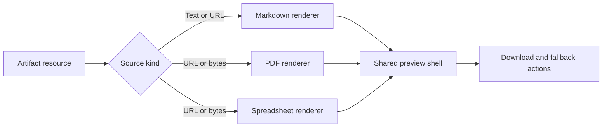

# Spectral Artifact Preview

This fixture validates **rich Markdown**, _semantic emphasis_, inline `code`, links, tables, task lists, mathematical notation, syntax highlighting, and Mermaid diagrams.

> A resource preview should preserve structure, remain readable in constrained layouts, and never require application-specific styling.

## Delivery checklist

- [x] Parse GitHub Flavored Markdown
- [x] Render mathematical notation
- [x] Render Mermaid diagrams
- [ ] Complete downstream visual review

### Nested structure

1. Resource acquisition
   - URL
   - Blob
   - ArrayBuffer
2. Format renderer
   - Markdown
   - PDF
   - Spreadsheet

## Compatibility matrix

| Format | Input | Renderer | Important behavior |
| --- | --- | --- | --- |
| Markdown | Text or URL | React Markdown | GFM, math, diagrams |
| PDF | URL or binary | PDF.js | Pagination, zoom, text layer |
| XLSX | URL or binary | SheetJS | Worksheets, merges, formulas |

## Mathematical model

Inline notation uses $E = mc^2$. A larger state model is:

$$
S(\lambda,t)=B(\lambda)+\alpha(t)R_s(\lambda),\qquad
\alpha(t)=\operatorname{clamp}\left(\frac{p(t)-p_0}{p_1-p_0},0,1\right).
$$

The normalized attention distribution is:

$$
P(z_k\mid x)=\frac{\exp\left(q(x)^T k_k/\sqrt{d}\right)}{\sum_{j=1}^{m}\exp\left(q(x)^T k_j/\sqrt{d}\right)}.
$$

## Mermaid topology



## TypeScript example

```ts
const artifact = {
  id: 'workbook-preview',
  type: 'xlsx',
  title: 'Operational workbook',
  content: '',
  source: { kind: 'url', url: '/artifact-preview/complex-workbook.xlsx' },
} satisfies Artifact
```

For additional context, see the [React Markdown project](https://github.com/remarkjs/react-markdown) and the [PDF.js project](https://mozilla.github.io/pdf.js/).
