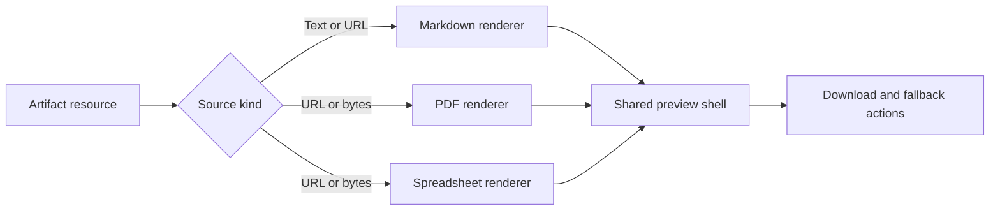

# Spectral Artifact Preview

This fixture validates **rich Markdown**, _semantic emphasis_, inline `code`, links, tables, task lists, mathematical notation, syntax highlighting, and Mermaid diagrams.

> A resource preview should preserve structure, remain readable in constrained layouts, and never require application-specific styling.

## Delivery checklist

- [x] Parse GitHub Flavored Markdown
- [x] Render mathematical notation
- [x] Render Mermaid diagrams
- [ ] Complete downstream visual review

### Nested structure

1. Resource acquisition
   - URL
   - Blob
   - ArrayBuffer
2. Format renderer
   - Markdown
   - PDF
   - Spreadsheet

## Compatibility matrix

| Format | Input | Renderer | Important behavior |
| --- | --- | --- | --- |
| Markdown | Text or URL | React Markdown | GFM, math, diagrams |
| PDF | URL or binary | PDF.js | Pagination, zoom, text layer |
| XLSX | URL or binary | SheetJS | Worksheets, merges, formulas |

## Mathematical model

Inline notation uses $E = mc^2$. A larger state model is:

$$
S(\lambda,t)=B(\lambda)+\alpha(t)R_s(\lambda),\qquad
\alpha(t)=\operatorname{clamp}\left(\frac{p(t)-p_0}{p_1-p_0},0,1\right).
$$

The normalized attention distribution is:

$$
P(z_k\mid x)=\frac{\exp\left(q(x)^T k_k/\sqrt{d}\right)}{\sum_{j=1}^{m}\exp\left(q(x)^T k_j/\sqrt{d}\right)}.
$$

## Mermaid topology



## TypeScript example

```ts
const artifact = {
  id: 'workbook-preview',
  type: 'xlsx',
  title: 'Operational workbook',
  content: '',
  source: { kind: 'url', url: '/artifact-preview/complex-workbook.xlsx' },
} satisfies Artifact
```

## 中文长内容测试

世界人工智能大会（WAIC）由外交部、国家发展和改革委员会、工业和信息化部、教育部、科学技术部、国务院国有资产监督管理委员会、国家互联网信息办公室、中国科学院、中国科学技术协会和上海市人民政府共同主办，自2018年创办以来已成为全球人工智能领域的顶级行业盛会，推动技术创新与国际合作。 大会涵盖会议论坛、展览展示、赛事评奖、应用体验、创新孵化、招才引智六大核心板块，并设立最高奖项卓越人工智能引领者奖（SAIL奖）。 2025年大会于7月26日至28日在上海举行，主题聚焦“智能时代 同球共济”；2026年大会于7月17日至20日在上海举办，以“智能伙伴 共创未来”为主题，展览规模首次超过10万平方米，突显其全球影响力。

For additional context, see the [React Markdown project](https://github.com/remarkjs/react-markdown) and the [PDF.js project](https://mozilla.github.io/pdf.js/).
